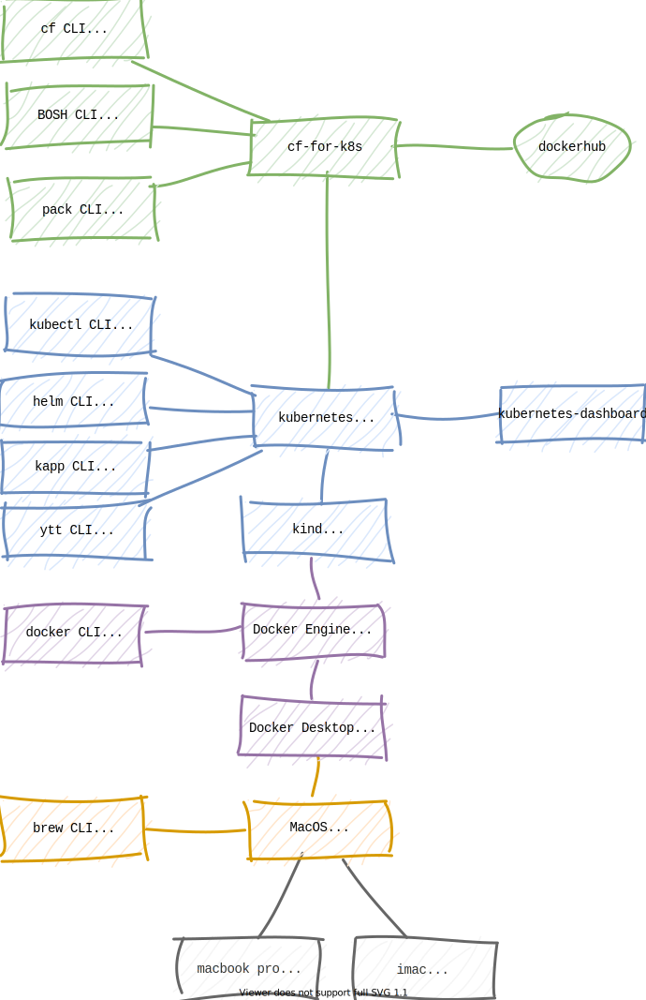

# cf4k8s locally 

> running cf4k8s locally for experimentation and learning

a firebreak hack to explore options for running CF locally using:

- [brew](https://brew.sh)
- [docker](https://docs.docker.com/)
- [minikube](https://minikube.sigs.k8s.io/docs/)
- [kind](https://kind.sigs.k8s.io/)
- [kubernetes](https://kubernetes.io/docs/home/)
- [cf-for-k8s](https://cf-for-k8s.io/docs/)

## Contents

- [casts](casts) - asciinema screencasts
- [Brewfile](Brewfile) - dependencies for mac
- [Makefile](Makefile) - document activities as a gnu make file
- [log](docs/log.md) - log of progress
- [resources](docs/resources.md) -some useful resources
